# Prepare and configure your SAP Business Technology Platform environment with the help of boosters

## Introduction

You will now prepare your SAP Business Technology Platform, configure your entitlements and configure your account for our extension scenario.

**Persona:** BTP Developer

> Note : if SAP Business Technology Platform is Trail Version Follow  [Prepare and Configure for Trail Account](#prepare-and-configure-for-trail-account)
>
> 

### Prepare your SAP Business Technology Platform Account

1. Navigate to *Boosters* 
2. Search for 'Prepare an Account for Developing Extension Applications'

   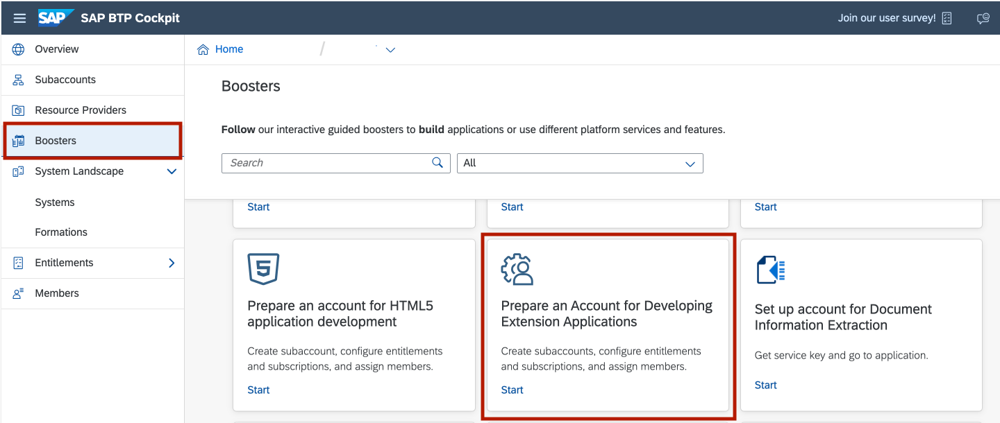

3. Click on the tile and chosse the *Start* button to start the creation of your account

   

4. Check if you fulfill all prerequisites and then choose *Next*

   

   - In case you see **WARNING**, it means _some optional services_ are not entitled in your global account. You can create the account, but without missing services
   - In case you see **ERROR**, it means _some mandatory services_ are missing and you need to check your global account entitlements 
   - In case you see **DONE**, it means _all necessary services_ are entitled and you can continue with next step
   
5. On the next screen you can set up your Subaccount: 
    - Configure the Entitlements
    - Remove: XFS Runtime and Extension Center
    - Add 1 Quota to Application Autoscaler
   

    - Enter Subaccount name - eg: "Development"
    - You can edit the smaller org name, space name (optional)
6. Click on *Next* to finish

   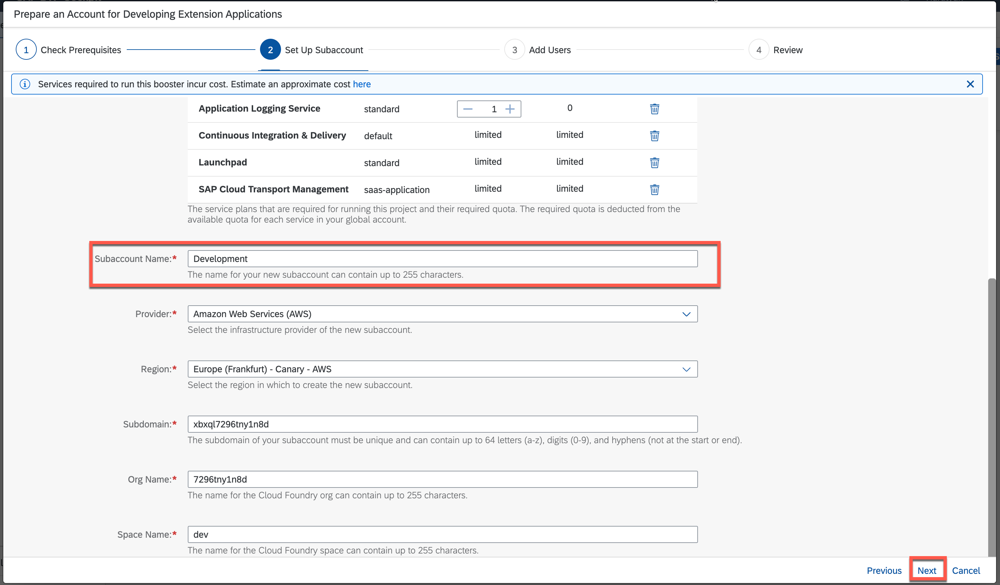

7. On the next screen you can add your needed Users:
 - Enter Administor's ID (you can enter IDs of people you would like to have the admin role)
 - Enter developer's ID
8. Click on *Next*

 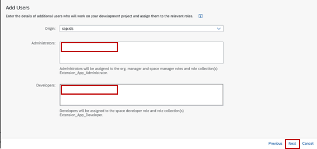

9. After you reviewed your account click on *Finish* 

10. Now click on your Subaccounts Name to open 

12. Navigate to *Entitlements* and click on *Configure Entitlements* 

 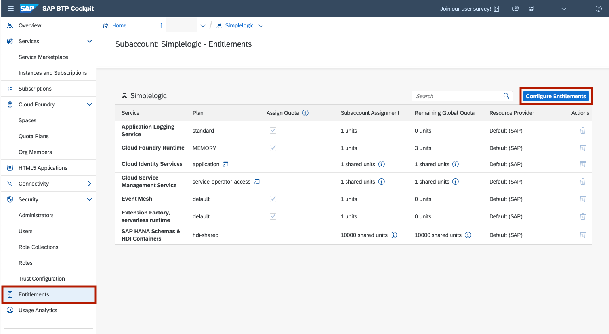

13. Then choose *Add Service Plans*

14. Search for "HANA" in the pop-up window and select *SAP HANA Cloud*

15. Click on the checkbox below "Available Plans" for HANA
    

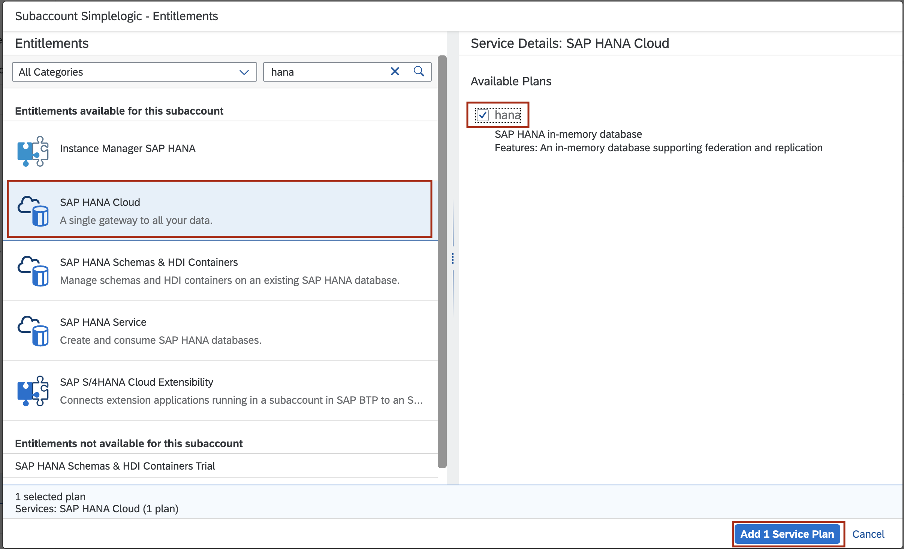

16. Search for "Alert Notification" in the pop-up window and select Alert Notification

17. Click on the checkbox below "Available Plans" for standard

18. Click on *Add 2 Service Plan* and save

###  Prepare and Configure for Trail Account

#### Event Mesh Setup

1. Log in to SAP BTP Account

2. In Subaccount go to **Service Marketplace** 

   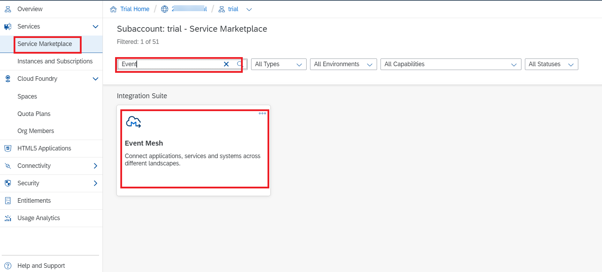

3. Click on _Actions_ button and Choose **Create**

   

4. Choose Plan as **Standard**

   

5. Click on **Create**

6. wait for a while till the subscription is created.

   

7. New Subscription is created and can be viewed in **Instances and Subscription** Tab

   

8. Go to **Security** Dropdown in Menu

   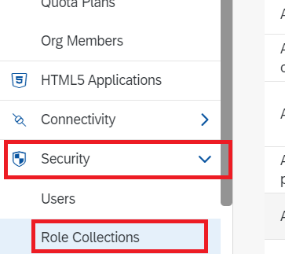

9. Then Click on **Role Collections**

10. Click on **"+"** button

    

11. Give the name as _Extension Developer_ and click **Create**

    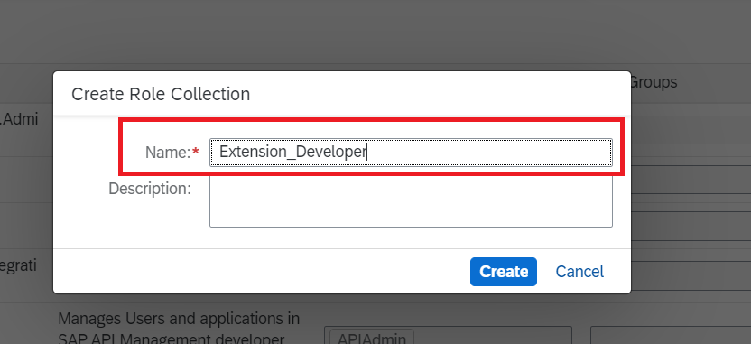

12. Search for _Extension Developer_ And Click on it.

    

13. Click on **Edit**.

    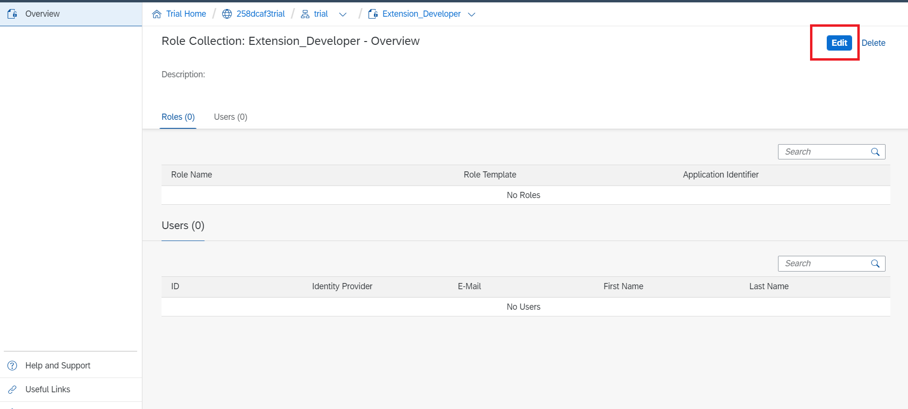

14. in Roles Section Click on Select Button

15. Search for _"Manage Role"_ and Select it

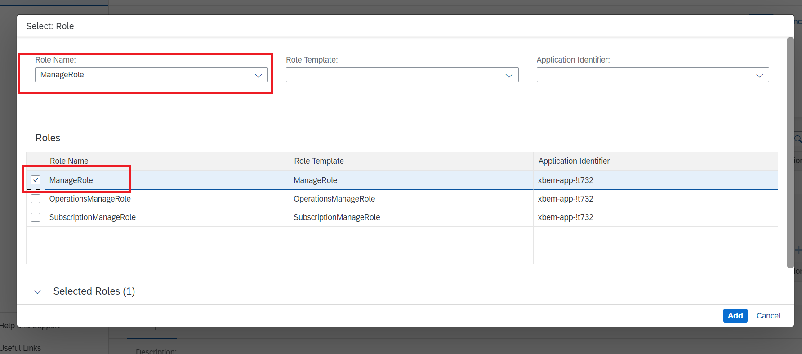

16. Search for _"Test Role"_ and select it and Click Add.

#### Cloud Transport Management Setup

1. In the **Instances and Marketplace** search for **Cloud Transport Management **
2. Click on Actions button and choose Create

​     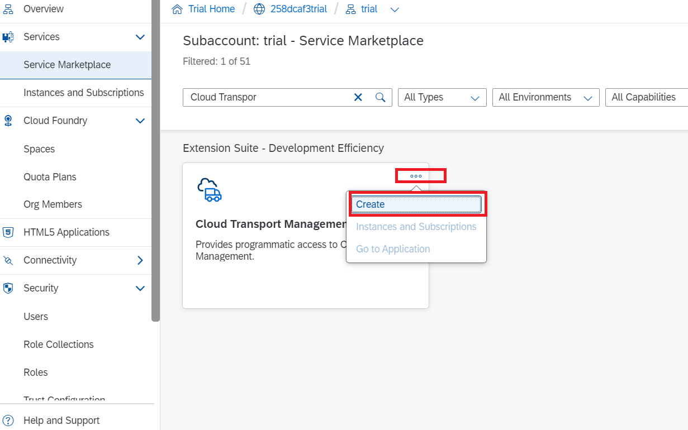

3. Select **Standard** Plan and click Create

   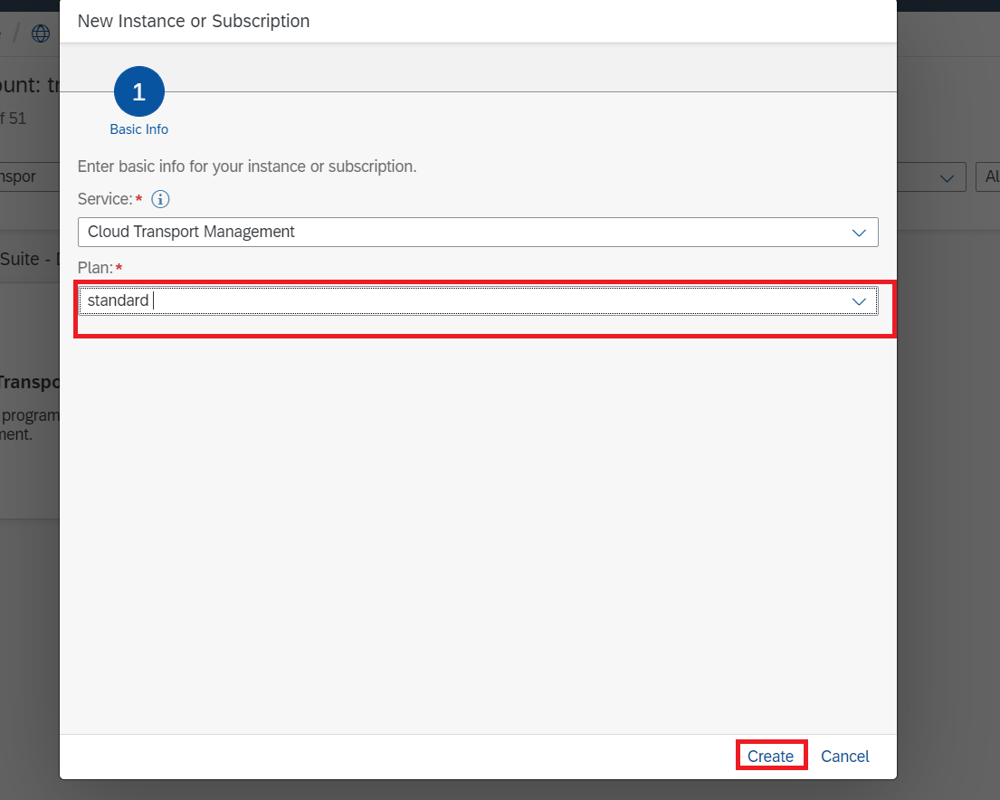

4. In **Security** Tab Select **Role Collections** and search for _Extension Developer_

   

   

5. Go to **Edit** Mode and Click on **Select** Tab

 

6. Search For _Administrator ( alm-ts!t1603 ), ImportOperator and  ExportOperator_ Roles and Assign it. 

   > Note: Search for Application Identifier which starts with _"alm-ts"_

   

7.After saving it roles are update. Below Image Depicts it.

#### Continuous Integration & Delivery Setup

1. Go to **Service Marketplace** and search for  **Continuous Integration & Delivery** and click on **Create** from Actions Tab.

   

2. Select **Trail** as Plan and click on _Create_

   

3. It should be visible in **Subscriptions** Tab.

4. Go to **Role Collections** from **Security** Tab in the Menu, Search for _Extension Developer_ And open it in _Edit_ Mode. Click on **Select** Tab and Search For _Administrator_ Role and select it. 

   > Note: For Continuous Integration and Delivery the Application Identifier starts with **"cicdservice"**

   

4. Repeat the same for _Developer_ Role as well and then click on **add**. **Save** it.

​       

#### Launchpad Service Setup

1. Click on **Service Marketplace**, Search for Launchpad Service and Click on **Create** from Actions

   

2. Select the **Plan** as **Standard**

   

3. Subscription should be visible in **Instances and Subscriptions**

4. Go to **Role Collections** from **Security** Tab in the Menu, Search for _Extension Developer_ And open it in _Edit_ Mode. Click on **Select** Tab and Search For _Mobile Admin_ Role and select it. 

   

5. Click on **Add** and **Save** it.

#### SAP Business Application Studio Setup

1. Click on **Service Marketplace**, Search for SAP Business Application Studio and Click on **Create** from Actions

   

2. Select the **Plan** as **trail**

   

3. Subscription should be visible in **Instances and Subscriptions**
4. Go to **Role Collections** from **Security** Tab in the Menu, Search for _Extension Developer_ And open it in _Edit_ Mode. Click on **Select** Tab and Search For _Administrator_ Role and select it. 

5. Search For _Developer_ and Select it and Click on **Add** button

6. Then **Save** it.

#### Adding Role Collections to Users

1. Go to **Role Collections** From **Security** Tab.

   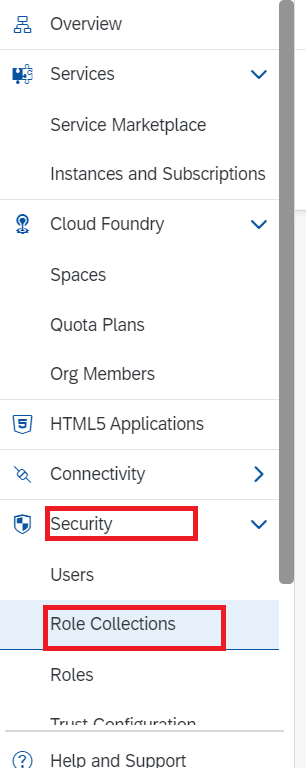

2. Search for _Extension Developer_ Role collections and open in **Edit** Mode. Switch to **User** tab.

   

   

3. Enter The Email Address in **ID** and Click on **"+"** to add Email.

4. Click on **Save** to save it.

   

SAP BTP environment has been successfully configured.