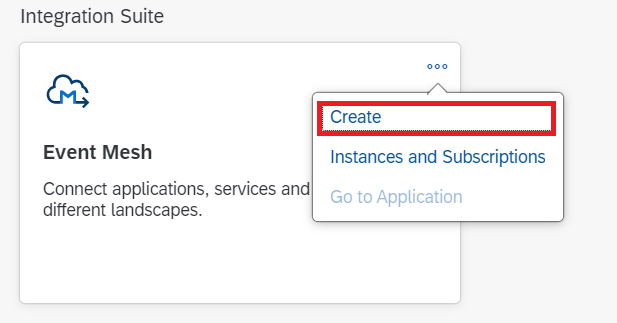
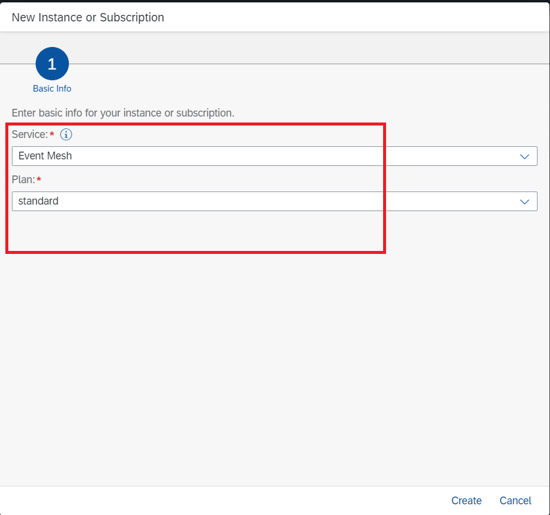
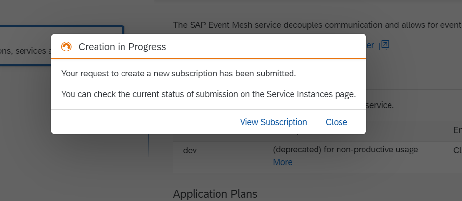
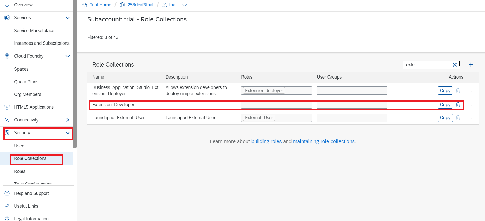
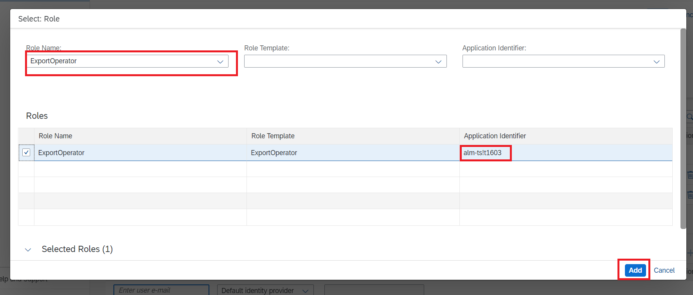
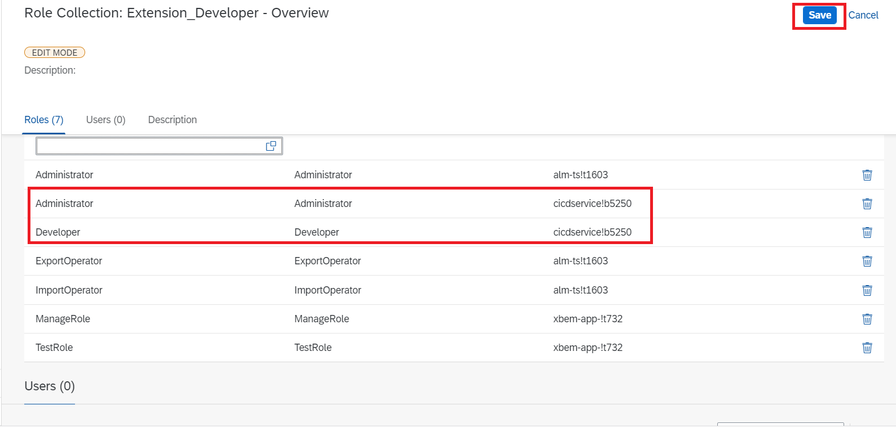
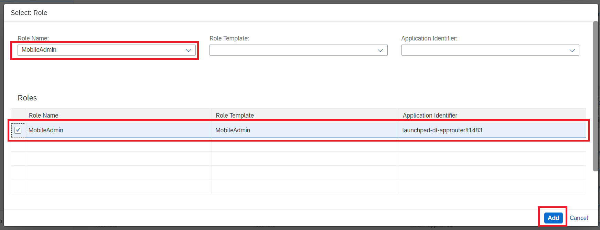
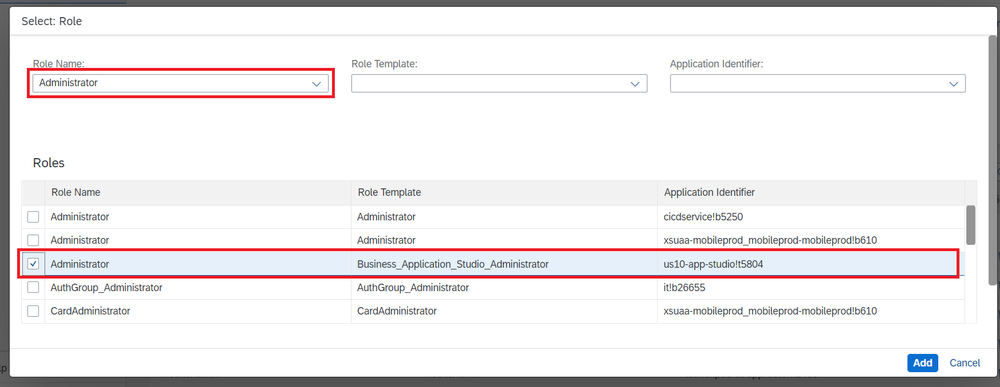
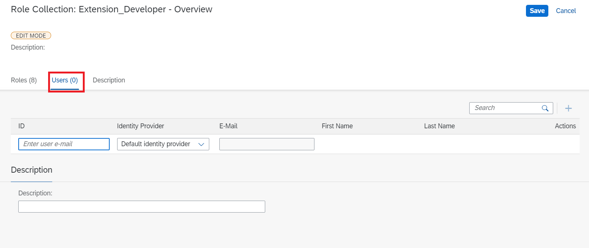

# Prepare and configure your SAP Business Technology Platform environment

## Introduction

You will now prepare your SAP Business Technology Platform (Trial) account, configure the needed entitlements and configure your account for the subsequent steps of this extension scenario.

#### Event Mesh Setup

1. Log in to SAP BTP Account on https://hanatrial.ondemand.com

2. Navigate to the subaccount you want to use and go to **Service Marketplace**. 

   

3. Click on _Actions_ button and Choose **Create**. 

   

4. Choose the **Standard** plan. 

   

5. Click on **Create**. 

6. Wait until the subscription has been created.

   

7. You can use **View Subscription** to get a more detailed view about the created subscription.

   

8. Go to **Security > Role Collections** in the side menu. 

   

9.  Click on **"+"** button to create a new Role Collection. 

    

10. Provide _Extension Developer_ as the name for the new Role Collection and click **Create**.

    

11. Search for _Extension Developer_ and click on it to open the Details View. 

    

12. **Edit** the Role Collection. 

    

13. Search for available Roles via clicking on the icon next to the role input field. 

15. Search for _"Manage Role"_ and select it. 

16. Search for _"Test Role"_, select it and click **Add**. .

#### Cloud Transport Management Setup

1. Go to the **Services > Service Marketplace** in the side menu and search for **Cloud Transport Management**. 
2. Click on _Actions_ button and choose **Create**.

​     

3. Select **Standard** Plan and click **Create**.

   

4. Go to **Security > Role Collections** in the side menu and select the _Extension Developer_ Role Collection. 

   

5.  **Edit** the Role Collection and search for available Roles via clicking on the icon next to the role input field. 

 

6. Search for _Administrator ( alm-ts!t1603 ), ImportOperator and  ExportOperator_ Roles and click **Add** to save the changes. 

   > Note: Search for Application Identifier which starts with _"alm-ts"_ to only get roles for the Cloud Transport Management service displayed. 

   

7. The Role Collection should now have the following roles: 

#### Continuous Integration & Delivery Setup

1. Go to **Service Marketplace** and search for  **Continuous Integration & Delivery** and click on **Create** from Actions Tab.

   

2. Select **Trail** as Plan and click on _Create_

   

3. It should be visible in **Subscriptions** Tab.

4. Go to **Role Collections** from **Security** Tab in the Menu, Search for _Extension Developer_ And open it in _Edit_ Mode. Click on **Select** Tab and Search For _Administrator_ Role and select it. 

   > Note: For Continuous Integration and Delivery the Application Identifier starts with **"cicdservice"**

   

4. Repeat the same for _Developer_ Role as well and then click on **add**. **Save** it.

​       

#### Launchpad Service Setup

1. Click on **Service Marketplace**, Search for Launchpad Service and Click on **Create** from Actions

   

2. Select the **Plan** as **Standard**

   

3. Subscription should be visible in **Instances and Subscriptions**

4. Go to **Role Collections** from **Security** Tab in the Menu, Search for _Extension Developer_ And open it in _Edit_ Mode. Click on **Select** Tab and Search For _Mobile Admin_ Role and select it. 

   

5. Click on **Add** and **Save** it.

#### SAP Business Application Studio Setup

1. Click on **Service Marketplace**, Search for SAP Business Application Studio and Click on **Create** from Actions

   

2. Select the **Plan** as **trail**

   

3. Subscription should be visible in **Instances and Subscriptions**
4. Go to **Role Collections** from **Security** Tab in the Menu, Search for _Extension Developer_ And open it in _Edit_ Mode. Click on **Select** Tab and Search For _Administrator_ Role and select it. 

5. Search For _Developer_ and Select it and Click on **Add** button

6. Then **Save** it.

#### Adding Role Collections to Users

1. Go to **Role Collections** From **Security** Tab.

   

2. Search for _Extension Developer_ Role collections and open in **Edit** Mode. Switch to **User** tab.

   

3. Enter The Email Address in **ID** and Click on **"+"** to add Email.

4. Click on **Save** to save it.

   

SAP BTP environment has been successfully configured.