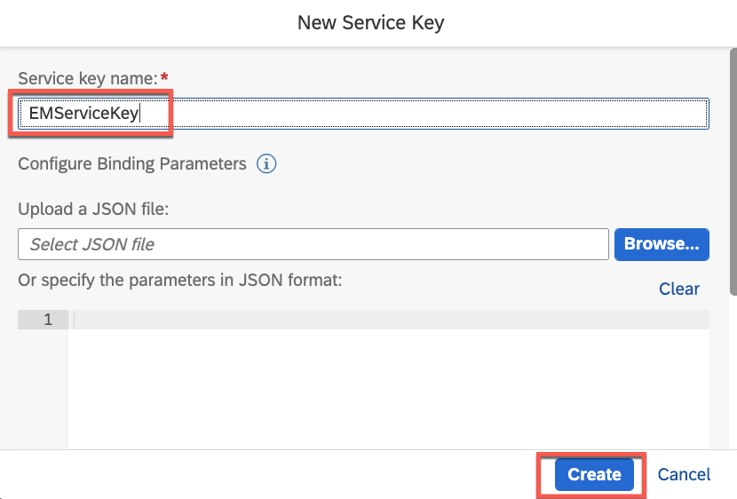
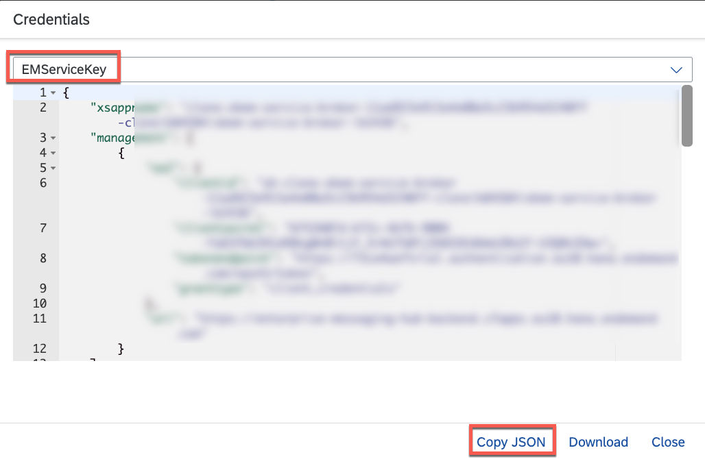
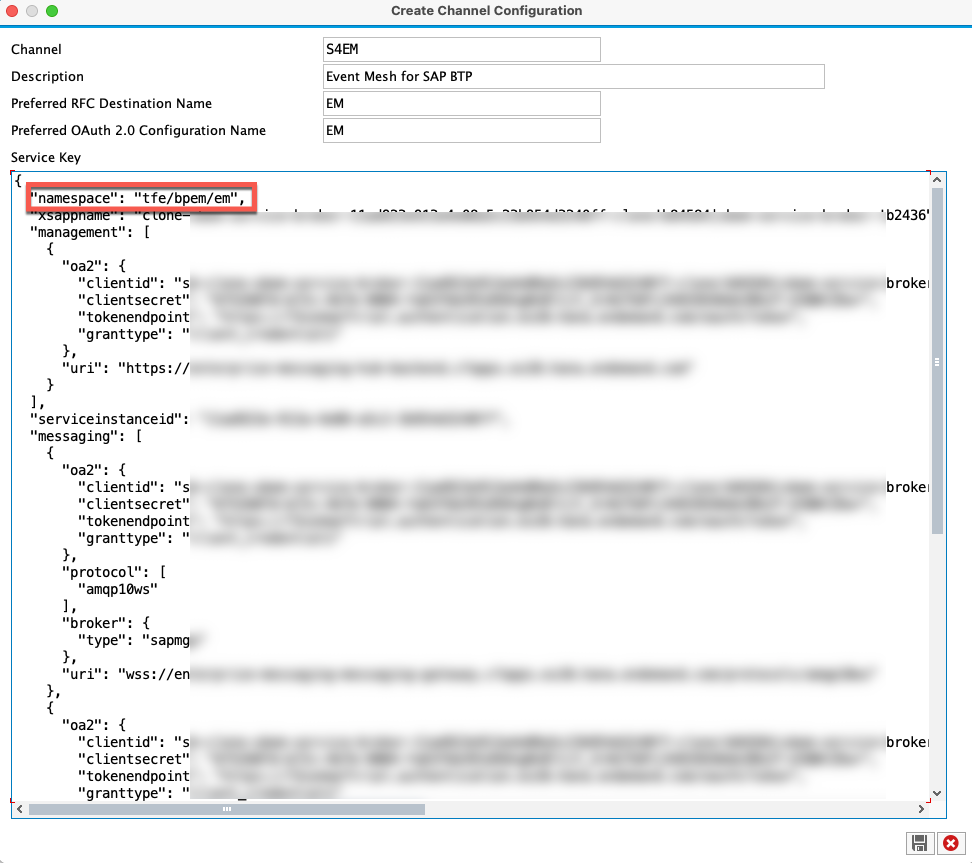

# Configure event based communication between S/4 and SAP Event Mesh
## Introduction

In this how to guide, you will establish a connection between your S/4HANA on premise System (2020) and SAP Event Mesh. This connection is needed to transport events from the SAP S/4HANA system to to the SAP Cloud Application Programming Model application. 

If you are using an S/4HANA 1909 (or older version), please follow the following instruction to setup a connection to the SAP Event Mesh service: https://help.sap.com/viewer/810dfd34f2cc4f39aa8d946b5204fd9c/1909.latest/en-US/fbb2a5980cb54110a96d381e136e0dd8.html

**Persona:** S/4HANA Developer

### Configure Endpoint

1. Open your browser and navigate to your subaccount in the SAP BTP Cockpit. 
2. Click on *Instances & Subscriptions* in the menu on the left.
   
 

3. Scroll to the Instances tab, and look for Event Mesh in the table. Now click on the 3 dots to open the dropdown and choose 'Create Serive Key'

 
 
5. Provide a service key name e.g. EMServiceKey. Click on create.

 
 
6.  Click on your created Service Key to open the detail view

 
  
7. Make sure you have the right service key opened. Click **Copy JSON** to copy the entire service key content. 

 
  ### Configure Channel
 
 1. Open your S/4 HANA system and navigate to the transaction */IWXBE/CONFIG*
 2. Click on *via Service Key*
 
 
 
 3. In the popup choose a *channel name* e.g. 'S4EM', provide a description and paste the *Service Key* you have created in the ealier steps. 

 
> **IMPORTANT:** 
> - If you are using SAP Event Mesh in the SAP BTP Trial environment: please provide the highlighted namespace ("tfe/bpem/em", including the semicolon at the end of the line) manually after pasting the service key content. It needs to be exactly the mentioned namespace, as this defines the exact topic/queue names the SAP Cloud Application Programming Model application is expecting.
> - If you are using SAP Event Mesh from a productive SAP BTP account, just paste the copied service key content without adding the namespace manually. (this should already be part)
 4. Then click on *save configuration*
  
 5. After your configuration is saved, click on the *Activate - Deactivate* button
 6. Click on *Check connection*
 7. Then click on *Outbound Bindings* to start the configuration
 
  
  
 8. In the next screen, first click on *Create*, then use the F4 help to look for the **BusinessPartner** topics. Select **sap/s4/beh/businesspartner/v1/BusinessPartner/*** topic. (the wildcard enables all BusinessPartner related events such as "Created" or "Changed" )

> the topic name in SAP Event Mesh is effectively a combination of the namespace you have provided within the service key ("tfe/bpem/em") concatenated with the actual topic name you have selected in this step. Hence, the resulting topic name is: *tfe/bpem/em/sap/s4/beh/businesspartner/v1/BusinessPartner/*. 
 
 