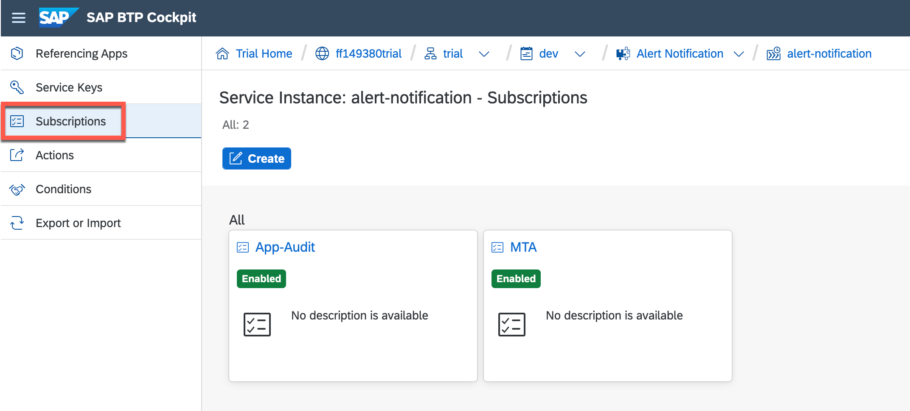

# SAP Alert Notification 

SAP Alert Notification service is a service in the DevOps portfolio of SAP BTP. It supports the operations by exposing real-time information about cloud-native as well as hybrid solutions. The service standardizes an environment-agnostic model across SAP BTP, so that users can benefit from the same configuration lifecycle and information model.


Service offers a variety of Built-In Events. The complete list can be found [here](https://help.sap.com/viewer/5967a369d4b74f7a9c2b91f5df8e6ab6/Cloud/en-US/2ef9c72833df4f2690f071c47f50f5af.html)

For our extension use-case we will define following Alerts:
* *Application Events* - get notifications when app stopped, crash, process crash, etc.
* *Multitarget Application Evetns* - get notification when the deployment or removal of a specific multitarget application has been initiated

1. Create Alert Notification Service instance
   - Go to Service Marketplace and create new instance
    
   - Give a name (e.b. alert-notification) and create
    

2. Go to Alert Notification cockpit
   - Select newly created instance and click on *"Manage Instance"*
   
   

3. Import Configuration
   
   

   - Copy the Configuration JSON and replace **<your@email.com>** with your email, where you want to receive the notifications
   - Past it and import

    ```json
        {
        "actions": [
            {
                "type": "EMAIL",
                "name": "send-email",
                "state": "ENABLED",
                "properties": {
                    "destination": "your@email.com",
                    "useHtml": "false"
                }
            },
            {
                "type": "STORE",
                "name": "tmp-store",
                "state": "ENABLED"
            }
        ],
        "conditions": [
            {
                "name": "Audit-App-Crash",
                "mandatory": false,
                "propertyKey": "eventType",
                "predicate": "EQUALS",
                "propertyValue": "app.crash",
                "labels": [],
                "description": ""
            },
            {
                "name": "Audit-App-Update",
                "mandatory": false,
                "propertyKey": "eventType",
                "predicate": "EQUALS",
                "propertyValue": "audit.app.update",
                "labels": [],
                "description": ""
            },
            {
                "name": "mta-category",
                "mandatory": false,
                "propertyKey": "category",
                "predicate": "EQUALS",
                "propertyValue": "NOTIFICATION",
                "labels": [],
                "description": ""
            },
            {
                "name": "Audit-App-Stop",
                "mandatory": false,
                "propertyKey": "eventType",
                "predicate": "CONTAINS",
                "propertyValue": "audit.app.stop",
                "labels": [],
                "description": ""
            },
            {
                "name": "Audit-App-Process-Crash",
                "mandatory": false,
                "propertyKey": "eventType",
                "predicate": "EQUALS",
                "propertyValue": "audit.app.process.crash",
                "labels": [],
                "description": "audit.app.process.crash"
            },
            {
                "name": "Audit-App-Start",
                "mandatory": false,
                "propertyKey": "eventType",
                "predicate": "EQUALS",
                "propertyValue": "audit.app.start",
                "labels": [],
                "description": ""
            },
            {
                "name": "mta-deployment",
                "mandatory": false,
                "propertyKey": "eventType",
                "predicate": "EQUALS",
                "propertyValue": "DEPLOYMENT",
                "labels": [],
                "description": ""
            },
            {
                "name": "mta-undeployment",
                "mandatory": false,
                "propertyKey": "eventType",
                "predicate": "EQUALS",
                "propertyValue": "UNDEPLOYMENT",
                "labels": [],
                "description": ""
            }
        ],
        "subscriptions": [
            {
            "name": "MTA",
            "conditions": [
                "mta-deployment",
                "mta-undeployment"
            ],
            "actions": [
                "tmp-store",
                "send-email"
            ],
            "state": "ENABLED"
            },
            {
            "name": "App-Audit",
            "conditions": [
                "Audit-App-Process-Crash",
                "Audit-App-Stop",
                "Audit-App-Crash",
                "Audit-App-Update"
            ],
            "actions": [
                "tmp-store",
                "send-email"
            ],
            "state": "ENABLED"
            }
        ]
    }
    ```

4. After Import you will find 2 Actions
   
   * *send-email*: will send e-mail when alert happens
   * *tmp-store*: stores the alert temporary in the service. Later it can be accessed e.g. via Cloud ALM
  
   
  
 >There are much more notification channels like slack, MS Teams, etc. The full list can be found [here](https://help.sap.com/viewer/5967a369d4b74f7a9c2b91f5df8e6ab6/Cloud/en-US/8a7e092eebc74b3ea01d506265e8c8f8.html). You can follow the documentation to configure further actions

5. Confirm your E-mail to activate the E-mail channel
   
   

6. Overview of Subscriptions
   
   To receive notifications about relevant events by SAP Alert Notification service, you need subscriptions to these alerts.

   We defined 2 Subscriptions
     * *App Audit* - get notifications when app stopped, crash, process crash, etc.
   * *MTA* - get notification when the deployment or removal of a  multitarget application has been initiated

   

7. Overview of Conditions

   We can open one of the above mentioned Subscriptions e.g. App Audit and check the conditions when the alert will be triggered. 

   

   Whenever one of following conditions will be matched, alert notification will trigger notification (in this example via e-mail)
   - App Stops
   - App Crash
   - App Process Crash
   - APP Updates

8. For application Events, we need to add the respective existing technical users according to their relevant data center. This user must have the Space Auditor permission. You add the user to the space by using its e-mail address.
   
   - List of technical users depending on the data center can be found [here](https://help.sap.com/viewer/5967a369d4b74f7a9c2b91f5df8e6ab6/Cloud/en-US/4255e6064ea44f20a540c5ae0804500d.html) 

   - In our case we have the service running in AWS-Frankfurt and the technical user is: sap_cp_eu10_ans@sap.com

   - Go to the space where your application is deployed and add the user as a member with Space Auditor role
   
     

9. Testing Alert Notification
    
    To test the alert notification we can trigger an event for app audit. We can manually stop the application, which will trigger the event and notify you via e-mail.

    - Go to the space and stop the application
    
      
     
    - Check your E-Mail, you will get the information that the application was stopped
    
      