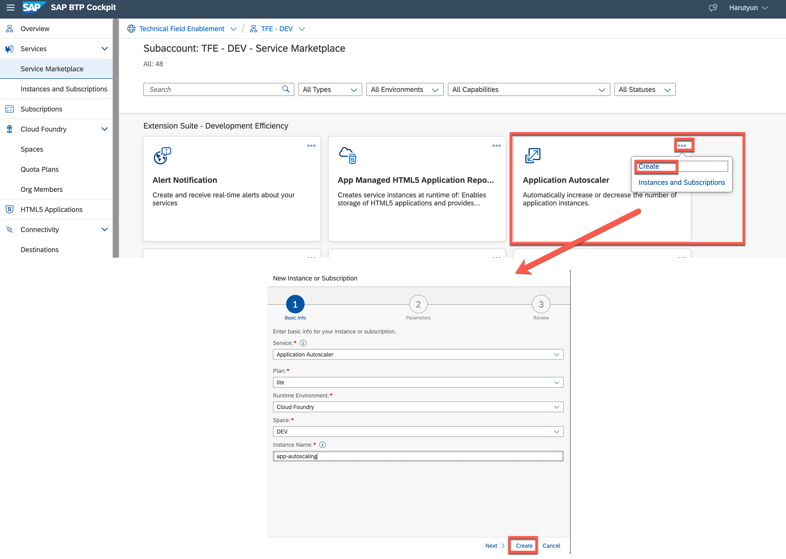
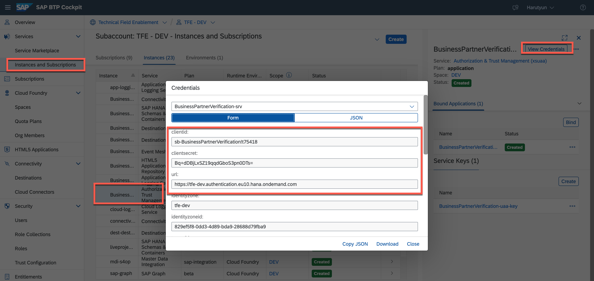
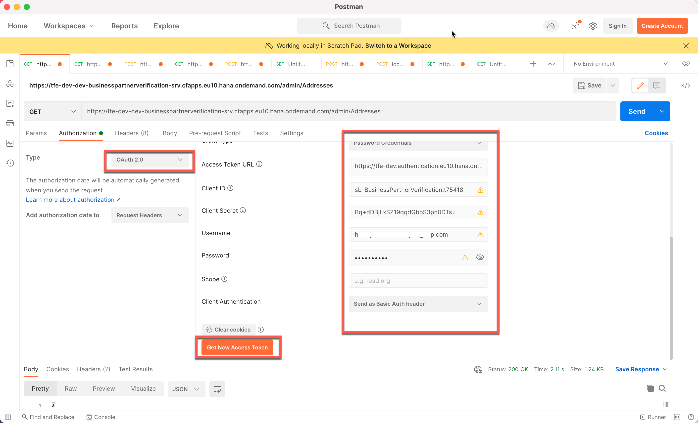
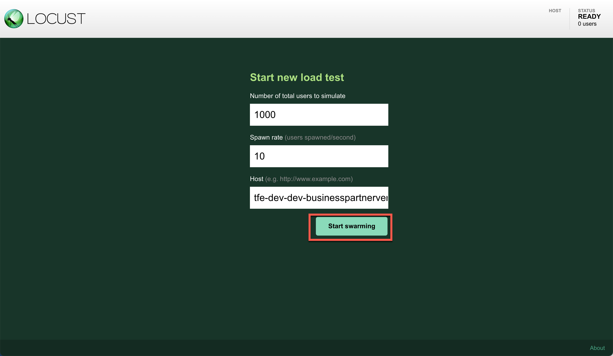
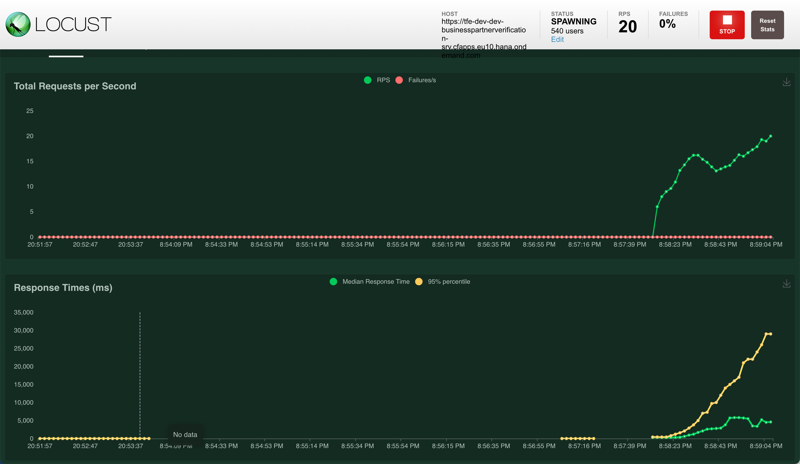
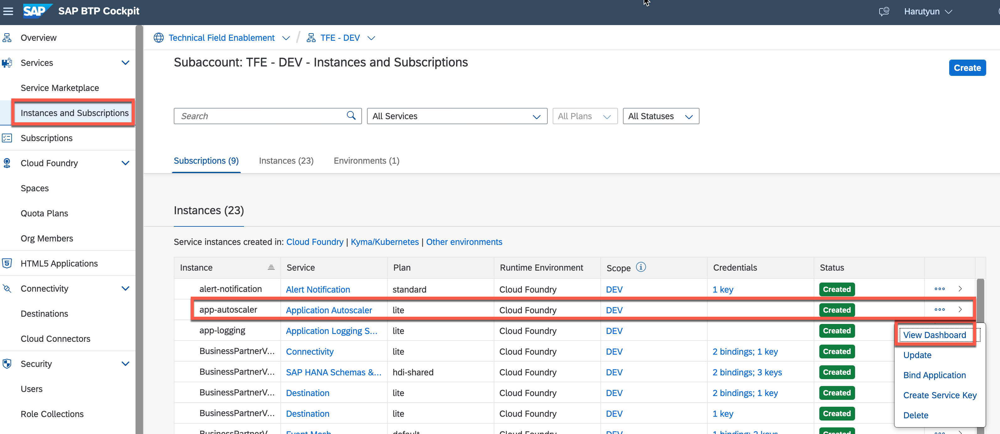
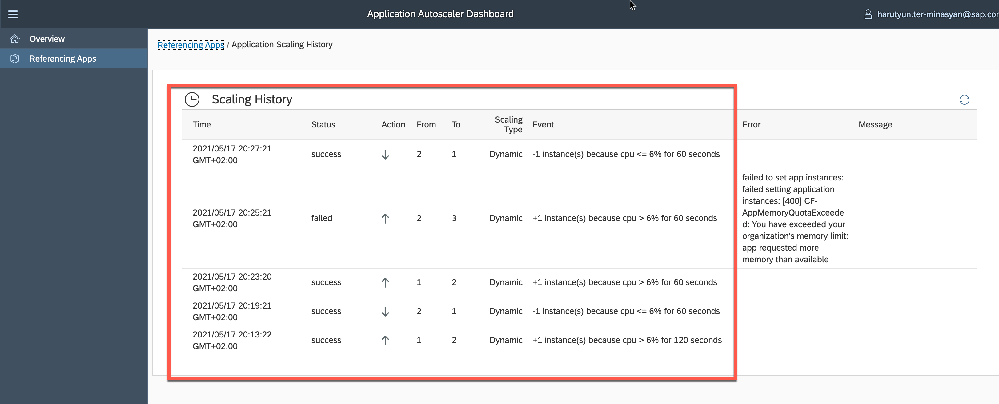

# Setup Application Autoscaler

Our extension application is consuming resources on our environment which can be measured as CPU usage, memory utilized, response times, network traffic etc.

The workload of application might change overtime. In this case, workload can grow or shrink at specific time based on usage. For example if our extension application is used parallel from 1000 users this will require more resources then just for few users.

To handle this kind of situations, we can assign a lot of resources to the application, but it is not optimal, since most of the time the unused resources will be idle.

A better approach is the Application Autoscaler service provided by SAP BTP on Cloud Foundry runtime to automatically scale our applications to meet the dynamic resource needs.

1. Creating Autoscaler service instance
   - Go to Service Marketplace
   - Create, new Service instance -> Application Autoscaler, Plan: lite
  
   
   
   
2. Binding to BusinessPartnerVerification-srv application
   - Go to service instance created in previous step
   - Bind to BusinessPartnerVerification-srv application
   - Copy the Policy from **Step 4**
  
   

3. Defining a Scaling Policy

   To initiate the scaling of an application, you need to define a policy. A policy is a JSON file containing an array of rules or a single rule for scaling. 

   There are two types of scaling policies:
    - **Dynamic Scaling Policy:** Scale your application instances based on memory/CPU usage, reponse time, throughput, or custom metrics.
    - **Schedule-Based Scaling Policy** - Scale your application instances based on schedules.

    For this example we will define Dynamic Policy

4. Define the Dynamic Policy

    ```json
    {
        "instance_min_count": 1,
        "instance_max_count": 5,
        "scaling_rules": [
            {
                "metric_type": "cpu",
                "breach_duration_secs": 60,
                "threshold": 6,
                "operator": ">",
                "cool_down_secs": 60,
                "adjustment": "+1"
            },
            {
                "metric_type": "cpu",
                "breach_duration_secs": 60,
                "threshold": 6,
                "operator": "<=",
                "cool_down_secs": 60,
                "adjustment": "-1"
            }
        ]
    }
    ```

    This rule states that, for the rule to execute, the application must have one instance running at minimum and the Application Autoscaler can scale the application till it has 5 instances running at maximum. The scaling rules are for CPU and states the following things.

    - Whenever threshold value of CPU reaches above 6, scale the application.
    - Breach duration seconds of 60 defines that the amount of time required to analyze the collected data of the metric CPU is 60 seconds.
    - Cool down seconds of 60 defines that the amount of time required between two successive scale triggers is 60 seconds.
    - Adjustment defines what to do when the rule conditions are satisfied. There are two rules in this case. one rule is scaling up the application instances and the other one is scaling down the instances.

    You can find further polices [here](https://help.sap.com/viewer/7472b7d13d5d4862b2b06a730a2df086/Cloud/en-US/e6927e5af85e45f4a8a056c8662fa784.html)

    >Note: the 6% CPU threshold is just an example to demonstrate the feature. In real usecases you should choose realistic thresholds

5. Testing the autoscaling
   
   To test the autoscaling we can use an open source load testing tool LOCUST to hit the application endpoint multiple times in parallel and cause it to auto scale.

   - Install Locust on your machine: follow the official [documentation](https://docs.locust.io/en/stable/installation.html) based on your OS type.
   
6. Create the test script:

   - create *load_test.py* and copy following snipped
   - replace *token* with JWT token: see step 6
   
    ```py

    from locust import HttpUser, TaskSet, task, between

    headers = {
        'cache-control': 'max-age=0',
        'dnt': '1',
        'upgrade-insecure-requests': '1',
        'user-agent': 'Mozilla/5.0 (Macintosh; Intel Mac OS X 10_15_3) AppleWebKit/537.36 (KHTML, like Gecko) Chrome/79.0.3945.130 Safari/537.36',
        'accept': 'text/html,application/xhtml+xml,application/xml;q=0.9,image/webp,image/apng,*/*;q=0.8,application/signed-exchange;v=b3;q=0.9',
        'sec-fetch-site': 'none',
        'sec-fetch-mode': 'navigate',
        'accept-encoding': 'gzip, deflate, br',
        'accept-language': 'en-US,en;q=0.9,de-DE;q=0.8,de;q=0.7,zh-CN;q=0.6,zh;q=0.5',
    }

    class UserBehaviour(HttpUser):
        wait_time = between(5, 9)
        token = "<JWT Access Token>"

        def make_request(self, method, endpoint):
            url = self.host + endpoint
            req_headers = headers
            req_headers['Authorization'] = 'Bearer ' + self.token
            with self.client.request(method=method, url=url, headers=req_headers, catch_response=True) as response:
                if response.status_code == 200:
                    response.success()

        @task()
        def task_1(self):
            self.make_request("GET", '/admin/Addresses?$top=1000')

        @task()
        def task_2(self):
            self.make_request("GET", '/admin/BusinessPartnerVerification?$top=1000')

        @task()
        def task_3(self):
            self.make_request("GET", '/admin/StatusValues')


    ```

7. Get JWT Token
   
   - Get the url, clientid, clientsecret from BusinessPartnerVerification-uaa instance


   

   Use e.g. postman to get Access Token
   
   - *Authorization Type:* OAuth 2.0
   - *Grant Type:* Password Credentials
   - *Access Token URL:* BusinessPartnerVerification-uaa -> url
   - *Client ID:* BusinessPartnerVerification-uaa -> clientid
   - *Client Secret:* BusinessPartnerVerification-uaa -> clientsecret
   - *Username:* BTP Email
   - *Password:* BTP Password

    

8. Run locust test
   
   Run following command in terminal 

   

    ```bash
     locust -f 'load_test.py'
    ```

9.  Open locust dashboard
   
   http://0.0.0.0:8089

   

11. Start new load test
    - Number of total users to simulate: 1000
    - Spawn rate (users spawned/second): 10
    - Host: BusinessPartnerverification-srv URL (e.g. https://tfe-dev-dev-businesspartnerverification-srv.cfapps.eu10.hana.ondemand.com)

    

    - run the test Approximately 2-3min and stop it

12. After the load test we can check autoscaling results
    
    - Open Application Autoscaler Dashboard
    
     

    - Open Scaling History
    
     

    - In scaling history you can see that, after matching the condition *CPU > 6%* it creates additional instance
    
     

>Note: the 6% CPU threshold is just an example to demonstrate the feature. In real usecases you should choose realistic thresholds